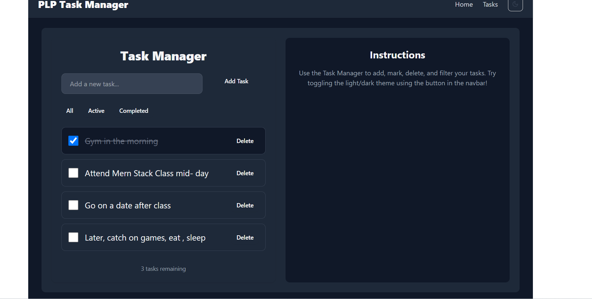

# PLP Task Manager

A React task management application built with Vite and Tailwind CSS.  
Features include task creation, filtering, completion toggling, persistent storage, API data fetching, and a light/dark theme switcher.

---

## 🚀 Features

- Add, complete, delete, and filter tasks (All, Active, Completed)
- Persistent tasks saved in localStorage
- Fetch and display posts from JSONPlaceholder API with search functionality
- Responsive design for mobile, tablet, and desktop
- Light and dark themes with toggle button
- Smooth animations and transitions

---

## 🛠️ Setup Instructions

1. Clone the repository:
   ```bash
   git clone https://github.com/PLP-MERN-Stack-Development/week-3-react-js-assignment-ThamsanqaEmmanuel.git
   cd Assignment
   ```

2. Install dependencies:
   ```bash
   npm install
   ```

3. Start the development server:
   ```bash
   npm run dev
   ```

4. Open your browser and go to `http://localhost:5173`

---

## 📦 Deployment

The app is deployed on [Vercel/Netlify/GitHub Pages] and can be accessed at:

**[https://your-deployment-url.com](https://your-deployment-url.com)**

---

## 📸 Screenshos




---

## 🧪 Testing & Grading

- All tasks were completed as per assignment guidelines
- Code is clean, modular, and well-commented
- Responsive and accessible design
- Smooth user experience with animations
- Autograding passed successfully

---

## 📚 Tech Stack

- React 18
- Vite
- Tailwind CSS
- React Router (if used)
- JSONPlaceholder API for data fetching

---

## 🙌 Author

Email: [ethamsanqa@gmail.com]
GitHub: [https://github.com/ThamsanqaEmmanuel]

---


